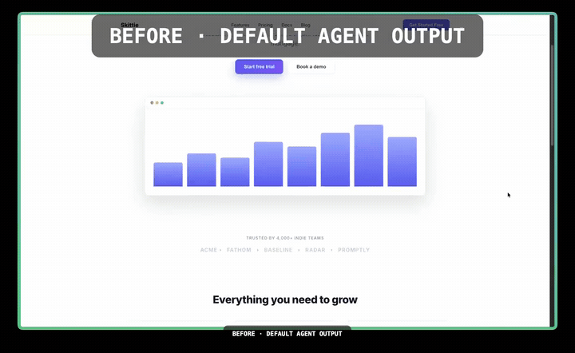
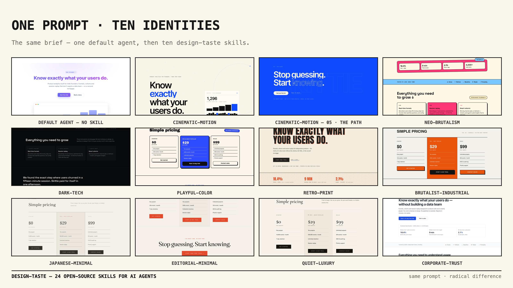

# design-taste

### Agent skills that make AI-generated interfaces look *designed*, not *generated*.

Every AI coding agent — Claude Code, Codex, Cursor, opencode — defaults to the same look: indigo-purple gradients, a centered hero, three feature cards, Inter, `slate-900`, `rounded-2xl`. Open any AI-built landing page and you can name the template in one glance.

It's not the model's fault. It's **taste** — and taste isn't in the training data.

This repo puts it back: **24 skills** (and counting) that teach your agent to read the brief, pick a design direction deliberately, and avoid the patterns that scream "AI-generated."

---



*The same brief, built twice: a default agent, then the `cinematic-motion` skill. The trailer above loops the full arc — the complete 39s film is [▶ one click away (mp4, 2.1 MB)](https://raw.githubusercontent.com/madebymustafa/design-taste/main/media/cinematic-motion-demo.mp4).*

---

## Don't take our word for it

Open these side by side in a browser. Same product, same copy, same sections — one built by a default agent, one built with `design-taste` loaded:

| Default agent output | With `design-taste` |
|---|---|
| [`examples/before.html`](examples/before.html) | [`examples/after.html`](examples/after.html) |

Five seconds, no tutorial needed. That's the whole pitch.

---

## The catalog

### Core

| Skill | What it does |
|---|---|
| [`design-taste`](skills/design-taste/SKILL.md) | The core anti-slop skill: read the brief → declare a design read → ban the LLM defaults → craft the details → pre-flight checklist. Applies to any UI generation. |

### Genre packs (opinionated identities — pick one per project)

| Skill | Identity | Demo |
|---|---|---|
| [`editorial-minimal`](skills/editorial-minimal/SKILL.md) | Swiss print: warm paper, ink, vermillion, serif + mono, hairline grids, indexed sections | [`after.html`](examples/after.html) |
| [`brutalist-industrial`](skills/brutalist-industrial/SKILL.md) | Declassified blueprint: visible grid rules, heavy caps, one signal color, mono coordinates | [`brutalist-industrial.html`](examples/brutalist-industrial.html) |
| [`quiet-luxury`](skills/quiet-luxury/SKILL.md) | Private bank annual report: ivory, deep ink, brass/oxblood accent, serif with italic flourishes | [`quiet-luxury.html`](examples/quiet-luxury.html) |
| [`dark-tech`](skills/dark-tech/SKILL.md) | Linear/Vercel school: near-black, hairline borders, mono metadata, one restrained accent | [`dark-tech.html`](examples/dark-tech.html) |
| [`playful-color`](skills/playful-color/SKILL.md) | Sticker-poster energy: giant heavy type, thick ink outlines, two saturated inks, hard offset shadows | [`playful-color.html`](examples/playful-color.html) |
| [`retro-print`](skills/retro-print/SKILL.md) | Riso/70s–80s print revival: warm stock, pigment inks, halftone dots, misregistered ink offsets, rubber stamps, poster type | [`retro-print.html`](examples/retro-print.html) |
| [`japanese-minimal`](skills/japanese-minimal/SKILL.md) | Wabi-sabi: rice paper, sumi ink, one seal-red hanko, mincho serif, negative space as the layout, one vertical text element | [`japanese-minimal.html`](examples/japanese-minimal.html) |
| [`neo-brutalism`](skills/neo-brutalism/SKILL.md) | Loud consumer web: every element ink-bordered, 6px hard shadows, one hot + one cool accent, chunky pills, confident copy | [`neo-brutalism.html`](examples/neo-brutalism.html) |
| [`corporate-trust`](skills/corporate-trust/SKILL.md) | Trust-first enterprise: white, one deep-blue accent, system type, evidence tables, compliance chips, restraint as the brand | [`corporate-trust.html`](examples/corporate-trust.html) |
| [`cinematic-motion`](skills/cinematic-motion/SKILL.md) | Site-of-the-day: the page as a film on studio print — paper canvas, ink type, one electric blue, alternating scene canvases, live product screen, scrubbed index counter, drag carousel, roadmap pin | [`cinematic-motion.html`](examples/cinematic-motion.html) |

### Craft skills (reference-grade rules, stack on any pack)

| Skill | What it does |
|---|---|
| [`taste-design-system`](skills/taste-design-system/SKILL.md) | Three-tier tokens (primitive → semantic → component), DTCG format, spacing/type scales, component anatomy, inventory audits, governance, adoption metrics |
| [`taste-typography`](skills/taste-typography/SKILL.md) | Pairing tables, fluid scales, line lengths, baseline rhythm, weight discipline, legibility minimums |
| [`taste-color`](skills/taste-color/SKILL.md) | 60-30-10 palette architecture, OKLCH ramps, WCAG 2.2 contrast math, semantic tokens, color-blind-safe pairs, dark mode |
| [`taste-motion`](skills/taste-motion/SKILL.md) | Duration/easing tokens, choreography, micro-interactions, reduced-motion compliance, what never to animate |
| [`taste-gsap`](skills/taste-gsap/SKILL.md) | GSAP implementation craft: context/matchMedia gating, timeline architecture, pin & scrub hygiene, transform-only animation, refresh-after-fonts, reduced-motion fallbacks |
| [`taste-accessibility`](skills/taste-accessibility/SKILL.md) | WCAG 2.2 AA built into generation: semantics, keyboard, focus, labels, targets, errors, testing ritual |
| [`taste-design-review`](skills/taste-design-review/SKILL.md) | Structured audit: capture → taste pass → Nielsen heuristics → a11y pass → severity-ranked findings → verify |
| [`taste-landing-page`](skills/taste-landing-page/SKILL.md) | Landing-page structure & conversion: 8-second rule, audience hero patterns, the selling sequence, CTA discipline, proof placement, pricing psychology, mobile behavior |
| [`taste-ux-copy`](skills/taste-ux-copy/SKILL.md) | UX writing: voice/tone, headline formulas, button labels, error→fix triads, empty states, status/loading text, before/after pairs |
| [`taste-brand-identity`](skills/taste-brand-identity/SKILL.md) | Logo/identity generation: concepting in two words, wordmark typography, lockups, clear space, favicon + og-image, one-page brand sheet |

### Code skills (the engineering half of taste)

| Skill | What it does |
|---|---|
| [`taste-code-craft`](skills/taste-code-craft/SKILL.md) | Code-level craft for agent-built UI: semantic HTML, token-driven CSS (zero hardcoded values), specificity discipline, no inline styles, no dead code |
| [`taste-web-performance`](skills/taste-web-performance/SKILL.md) | Core Web Vitals budgets: LCP/CLS/INP targets, font loading without layout shift, image discipline, CSS/JS delivery, verify ritual |
| [`taste-code-review`](skills/taste-code-review/SKILL.md) | Six-pass review order (behavior → structure → taste → security → performance → a11y), severity-ranked findings, diff discipline |

**How they compose:** genre packs decide the *identity*; craft skills police the *details*; code skills police the *delivery*. The core skill runs on everything. Install all and your agent picks what it needs from the description.

## Install (5 seconds)

```bash
git clone https://github.com/<you>/design-taste.git
cd design-taste
./scripts/install.sh              # installs all 24 skills to every agent it finds
```

Or manually — copy the `skills/*` folders into your agent's skills directory:

| Agent | Path |
|---|---|
| Claude Code | `~/.claude/skills/` |
| Cursor | `~/.cursor/skills/` |
| Codex | `~/.codex/skills/` |
| opencode | `~/.config/opencode/skills/` |
| Cline / Roo | `~/.cline/skills/`, `~/.roo/skills/` |

See [docs/INSTALL.md](docs/INSTALL.md) for details. To check your install: `./scripts/validate.sh` — every skill must pass before a release.

*Why this exists, and the honest bet we're making:* the same brief rendered ten ways in [gallery/README.md](gallery/README.md) is the whole argument — taste is instructions, and instructions ship.

## Repo layout

```text
design-taste/
├── skills/             # 24 skills — one folder per skill, SKILL.md inside
├── examples/           # before/after demo pair + one demo per genre pack
├── gallery/            # screenshot gallery (community before/afters)
├── docs/               # INSTALL, CONTRIBUTING
└── scripts/            # install.sh, validate.sh
```

## Roadmap

- [x] core `design-taste` + 10 genre packs + 13 craft/code skills
- [x] before/after demo for every genre pack
- [ ] `taste-figma-tokens` — Figma ↔ code token sync workflow
- [ ] CI: render-to-screenshot pipeline that diffs pages with/without skills
- [ ] community gallery & pack marketplace

## Gallery

Before/after pairs from real agent runs — [gallery/](gallery/). Add your own; it's the best PR you can make.

And the whole family on one board — same brief, ten identities:



## License

MIT. Use it, fork it, sell the output — just don't claim you made the taste.

---

*Built by a designer. If the examples look intentional, that's the point.*